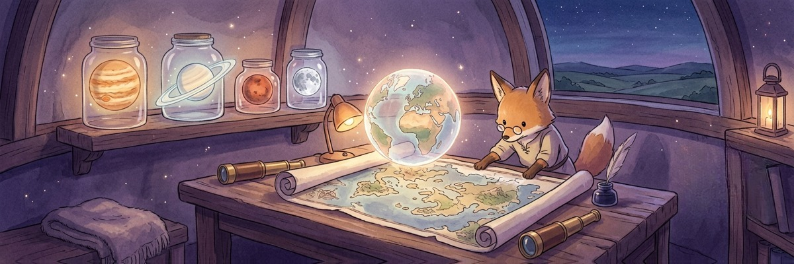
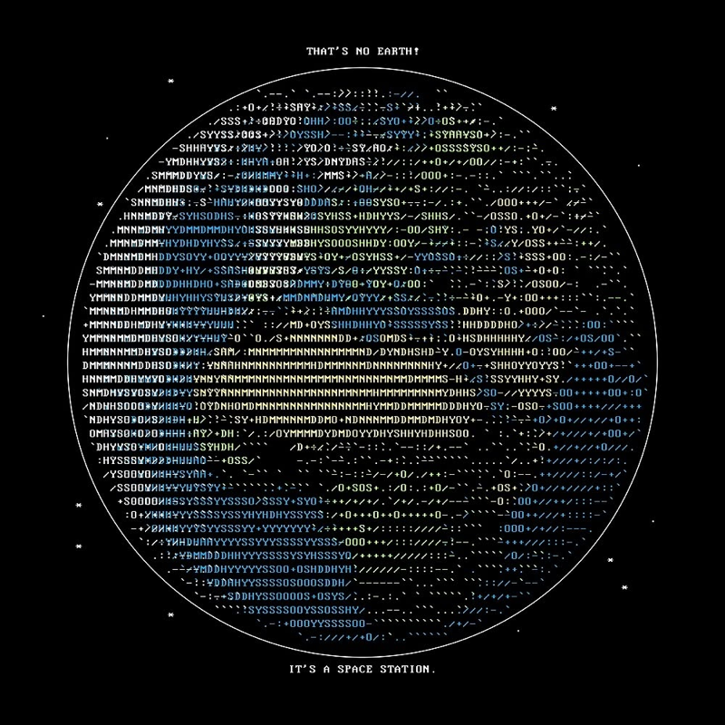

<div align="center">

# ascii-earth

**Рисует планеты, Луну и Солнце живым глобусом прямо в терминале**

[](LICENSE)
[](https://python.org)
[](https://numpy.org)
[](https://python-pillow.org)

</div>

Реальная equirectangular-текстура back-проецируется на сферу (ортографическая проекция), сэмплируется по каждой ячейке терминала и раскрашивается. Диск стоит в звёздном поле на весь экран, подписи приклеены к верхней и нижней границе, а управление — живьём с клавиатуры и мыши: день/ночь по реальному положению солнца, кольца Сатурна, реальные относительные размеры и куча палитр. Текстуры в комплекте — работает офлайн.

## ■ Features

- ❖ **11 тел** — Земля, Солнце, Меркурий, Венера, Луна, Марс, Юпитер, Сатурн, Уран, Нептун, Церера; переключение на лету через `<` / `>`
- ❖ **Кольца** — у Сатурна и Урана эллипс с честным заслонением сферой (передняя дуга поверх диска, задняя скрыта), Cassini-щель и азимутальные сгустки, чтобы вращение было видно
- ❖ **День/ночь в реальном времени** (`--sun`) — освещение по текущей подсолнечной точке; ночная сторона уходит в яркий чёрно-белый
- ❖ **Слежение за солнцем** (`--follow`) — вид со стороны солнца, всегда видна дневная сторона, Земля вращается с реальной скоростью (оборот за 24 ч)
- ❖ **Режимы масштаба** (`m`) — `fit`, `real` (реальные радиусы: Солнце — стена, Церера — точка) и `sqrt` (читаемый компромисс)
- ❖ **3 режима глифов** (`g`) — braille (субпиксель 2×4), плотный 56-уровневый UTF-8 ramp и обычный ASCII
- ❖ **10 палитр** (`p`) — natural, political, blue, green, amber, ice, mono, inferno, neon, catppuccin
- ❖ **Мышь + клавиатура**, вывод truecolor / 256 / ч-б, работает под tmux и mosh

## ■ Stack

<div align="center">

| Component | Technology |
|-----------|-----------|
| Language | Python 3.9+ |
| Image sampling | Pillow |
| Vector maths | NumPy |
| Projection | Orthographic back-projection, per-cell texture sampling |
| Output | ANSI truecolor / 256-colour, Braille & UTF-8 glyphs |
| Input | termios raw mode, SGR mouse |
| Day/night | Sub-solar point from UTC (declination + hour angle) |
| Textures | NASA Blue Marble (PD) + Solar System Scope (CC-BY 4.0) |

</div>

## ■ How It Works

```
1. Выбираешь тело — грузится его equirectangular-текстура (в комплекте, офлайн)
2. Каждая ячейка терминала back-проецируется на сферу, там сэмплируется текстура
3. В braille-режиме ячейка супер-сэмплируется в матрицу 2x4 точки; диск собран как viewport и обрезается у краёв
4. Палитра раскрашивает поверхность; звёздное поле заполняет остаток экрана
5. --sun рисует мягкий терминатор от реальной подсолнечной точки; кольца — эллипс с заслонением
6. Клавиатура и мышь управляют вращением, зумом, телом, масштабом, палитрой и день/ночью вживую
```

## ■ Screenshots

<div align="center">


*Земля в палитре natural, вращается в реальном терминале*


*Сатурн и Уран с кольцами*



*Исходный ASCII-постер, с которого начался ascii-earth*

</div>

## ■ Usage

```bash
# Установка с GitHub
pip install "git+https://github.com/pluttan/ascii-earth"

# Интерактивно (клавиатура + мышь)
ascii-earth -i

# Одиночные постеры
ascii-earth --body saturn --lat 26      # Сатурн, кольца раскрыты
ascii-earth --sun                       # Земля сейчас: день и ночь
ascii-earth --scale real --body mars    # реальный относительный размер
ascii-earth --palette catppuccin --color truecolor
```

## ■ Текстуры и атрибуция

Текстуры в комплекте, под своими лицензиями: **Земля** — NASA Blue Marble, public domain; **остальные тела** — [Solar System Scope](https://www.solarsystemscope.com/textures), **CC-BY 4.0** (атрибуция обязательна).

## ■ License

MIT © [pluttan](https://github.com/pluttan)
